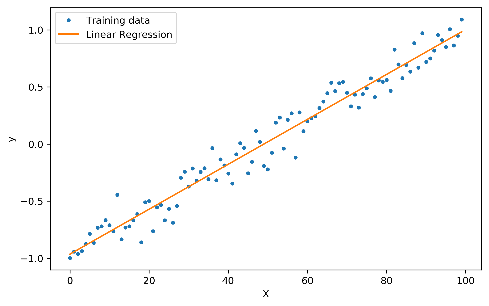

# Linear regression 

In the notebook, we solve a linear regression problem using gradient descent as well as normal equation. Here is the theoretical background for the notebook. 

## Model representation

In a linear regression problem with two **parameters** $\theta_0, \theta_1$, the form of our **hypothesis**:  
$$
h_{\theta}(x) = \theta_{0} + \theta_{1}x
$$
How to find the best fit line? We need to choose $\theta_{0}$,  $\theta_{1}$ so that  $h_{\theta}(x)$ is close to y for our training examples (x, y). Formally put, our **cost function** can be written as follows. Cost is basically a measure of accuracy of a hypothesis function (lower the better). 

$$
J(\theta) = \frac{1}{2m}\sum^{m}_{i=1}(h_{\theta}(x^{(i)})-y^{(i)})^2\\
$$
Our **Goal** is:
$$
\underset{\theta_0, \theta_1} {\text{min}}\ J(\theta_0, \theta_1)
$$

## Gradient Descent 

Gradient descent is to find the solution for any/general functions, not only linear regression. Let us assume a linear regression where there are two parameters, $\theta_0, \theta_1$. 

Given, 

* A hypothesis function $h_{\theta}(x)$
* Cost function $J(\theta_0, \theta_1)$ <- measure of how well it fits into the data

* Want $(\theta_0, \theta_1)$ that minimizes $J$ 

Perform

* Start with some $\theta_0, \theta_1$
* Keep changing $\theta_0, \theta_1$ to reduce cost function $J(\theta_0, \theta_1)$ until we hopfully end up at a minimum

Specifically do, 

* Take derivative (the tangential line to a function) of our cost function
* The slope of the tangent is the derivative at that point = direction to move towards 

* We make stapes down the cost function in the direction with the steepest descent
* The size of each step is determined by the parameter $\alpha$, running rate

repeat until convergence {
$$
\theta_j:=\theta_j - \alpha\frac{\partial}{\partial \theta_j}J(\theta)
$$
}

where $j$ represents the feature index number and $\alpha$ is learning rate. 

### Gradient Descent for Linear Regression

Repeat until convergence {
$$
\theta_0 := \theta_0 - \alpha \frac{1}{m}\sum_{i=0}^{m} {(h_{\theta}(x^{(i)})- y^{(i)})} \\

\theta_1 := \theta_1 - \alpha \frac{1}{m}\sum_{i=0}^{m} {(h_{\theta}(x^{(i)})- y^{(i)})}x^{(i)}
$$
}

### Derivation

Remember gradient descent is:
$$
Repeat \ until\ convergance \ \theta_j := \theta_j - \alpha \frac {\partial}{\partial \theta_j}J(\theta)
$$
Linear regression is: 
$$
h(\theta_0, \theta_1) = \theta_0 + \theta_1x \\
J(\theta) = \frac {1} {2m} \sum_{i=0}^{m} {(h_{\theta}(x^{(i)}) - y^{(i)})^2}
$$
Derivative term in gradient descent for linear regression is; 
$$
\frac {\partial}{\partial \theta_j} J(\theta) = \frac {\partial}{\partial \theta_j} \frac {1} {2m} \sum_{i=0}^{m} {(h_{\theta}(x^{(i)}) - y^{(i)})^2} \\
\ \\
= \frac {\partial}{\partial \theta_j} \frac {1} {2m} \sum_{i=0}^{m} {(\theta_o + \theta_1x^{(i)} - y^{(i)})^2} \\
$$
For each parameter, 
$$
\theta_0 := \theta_0 - \alpha \frac{1}{m}\sum_{i=0}^{m} {(\theta_o + \theta_1x^{(i)} - y^{(i)})}\\
\theta_1 := \theta_1 - \alpha \frac{1}{m}\sum_{i=0}^{m} {(\theta_o + \theta_1x^{(i)} - y^{(i)})}x^{(i)}
$$
To rewrite the gradient descent algorithm: 

Repeat until convergence {
$$
\theta_0 := \theta_0 - \alpha \frac{1}{m}\sum_{i=0}^{m} {(h_{\theta}(x^{(i)})- y^{(i)})} \\

\theta_1 := \theta_1 - \alpha \frac{1}{m}\sum_{i=0}^{m} {(h_{\theta}(x^{(i)})- y^{(i)})}x^{(i)}
$$
}

Note that cost function for the linear regression is always convext function, meaning there is only one global minimum and no local minimum. (the given J is a convex quadtratic function)

## Normal Equation 

We can also solve for $\theta$ analytically using normal equation. 

Let us say we have $m$ examples $(x^{(1)}, y^{(1)}), ..., (x^{(m)}, y^{(m)})$ and $n$ features. 
$$
x^{(i)} = 

\begin{bmatrix}
x_0^{(i)}\\
x_1^{(i)}\\
\vdots\\
x_n^{(i)}\\
\end{bmatrix}
\in \R^{(n+1)}\\
$$
Design matrix $X$ is
$$
\ \\
X = \begin{bmatrix}
-(x^{(0)})^T-\\
-(x^{(1)})^T-\\
\vdots\\
-(x^{(m)})^T-\\
\end{bmatrix}
\\
$$
Solution is 
$$
y = X\theta \\
\theta = (X^TX)^{-1}X^Ty
$$

### Derivation

Our cost function $J(\theta) = \frac{1}{2m} \sum_{i=1}^{m} (h_{\theta}(x^{(i)})-y^{(i)})^2$ can be written with matrix notation as following because dot product of itself is the sum of sqaures of the entries: 
$$
J(\theta) = (X\theta - y)^{T}(X\theta-y)
$$
Note that $(X\theta)^T=\theta^TX^T$. i.e. transpose of a dot product is transpose of individual's transpose in the opposite order. 
$$
J(\theta) = (\theta^T X^T - y^T)(X \theta -y) \\
\
=\theta^T X^T X \theta -\theta^T X^Ty - y^TX\theta + y^T y \\
$$
Here, $\theta^T X^Ty = y^TX\theta $ because of the same principle of transpose of dot product. i.e. $(ABC)^T = C^T B^T A^T$. So, we can rewrite the formula. 
$$
J(\theta) = \theta^T X^T X \theta - 2\theta^T X^Ty + y^T y \\
$$
Now, if we take partial derivative of $J$ with respect to $\theta$, the irrelvant term $y^Ty$ disappears and only the rest of two terms remain. More information about matrix derivation can be found it [here](https://www.math.uwaterloo.ca/~hwolkowi/matrixcookbook.pdf). 
$$
\frac{\partial J(\theta)}{\partial \theta} = 2X^TX\theta - 2X^Ty
$$
As our goal is to find $\theta$ that makes $\frac {\partial J(\theta)} {\partial \theta} =0$, we can set the above equation to zero.
$$
2X^TX\theta = 2X^Ty \\
X^TX\theta = X^Ty \\
$$
Assuming $X^TX$ is invertable, our optimal  $\theta$ can be found as following.
$$
\theta = (X^TX)^{-1}X^Ty
$$

## Graidient Descent vs. Normal Equation 

* Gradient Descent 
  * Needs to choose learning rate $\alpha$
  * Needs many iterations
  * $O(kn^2)$
  * Works well for large features (e.g. more efficient if # of features are more than 10,000)
* Normal Equation 
  * No need to choose learning rate $\alpha$
  * Don't need to iterate 
  * Need to compute $(X^TX)^{-1}$ where inverting a matrix is $O(n^3)$ 
  * Slow if $n$ is very large 

